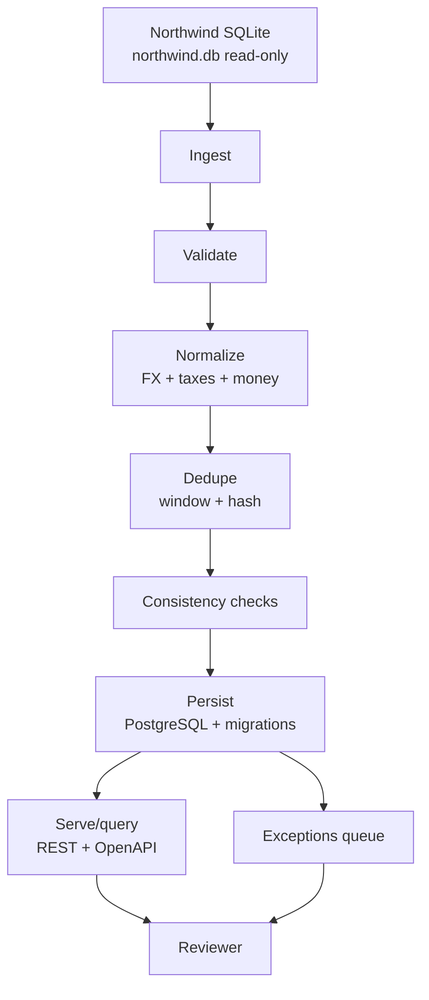

# LedgeProject

Servicio pequeño para ingerir Northwind SQLite, traducirlo a un modelo canónico de órdenes/líneas, aplicar reglas de negocio, persistir en PostgreSQL con migraciones y exponer una API de solo lectura con reingesta idempotente.

El objetivo es que un revisor pueda ver qué se procesó, qué quedó con excepciones y volver a disparar la ingesta sin duplicar órdenes confirmadas. El proyecto prioriza trazabilidad: pipeline explícito, logs JSON con `runId` y `correlationId`, esquema versionado y decisiones documentadas.

## Arquitectura



## Qué es / problema / usuarios

El servicio toma la base Northwind como fuente fija de referencia, la copia al arranque a un área de runtime y la procesa sin mutar el archivo original. Modela un canónico propio fuerte para `Order` y `Line`, de modo que la persistencia no dependa de la forma original de la fuente.

Está pensado para dos perfiles: un revisor técnico que quiere inspeccionar el pipeline, los datos y las excepciones; y un equipo que necesita una base reproducible para seguir creciendo sobre un flujo de ingesta observable y testable.

## Fuente Northwind + verificación

Fuente obligatoria usada por el proyecto:

https://raw.githubusercontent.com/jpwhite3/northwind-SQLite3/4f56e7f5906dfd23b25244c5bfe8fb5da6402efd/dist/northwind.db

El archivo se trata como referencia fija. El servicio copia `northwind.db` a `.runtime/northwind.db` al arrancar y trabaja sobre esa copia de solo lectura. El archivo incluido en este repo tiene:

- Tamaño: `24,702,976` bytes
- SHA-256: `2F4F5C68DFCD33BA27373EAE48C7A4869800C68095EE0F9F0DA494F83382A877`

Comandos para descargar y verificar manualmente:

```bash
curl -L -o northwind.db https://raw.githubusercontent.com/jpwhite3/northwind-SQLite3/4f56e7f5906dfd23b25244c5bfe8fb5da6402efd/dist/northwind.db
sha256sum northwind.db
```

En PowerShell:

```powershell
Invoke-WebRequest -Uri "https://raw.githubusercontent.com/jpwhite3/northwind-SQLite3/4f56e7f5906dfd23b25244c5bfe8fb5da6402efd/dist/northwind.db" -OutFile northwind.db
Get-FileHash .\northwind.db -Algorithm SHA256
(Get-Item .\northwind.db).Length
```

## Modelo canónico

Ejemplo JSON de la forma canónica persistida:

```json
{
	"sourceOrderId": 10248,
	"sourceCustomerId": "VINET",
	"customerCompanyName": "Vins et alcools Chevalier",
	"shipCountry": "France",
	"orderedAt": "1996-07-04T10:00:00.000Z",
	"orderedAtEpoch": 836280000,
	"currency": "EUR",
	"fxRateToUsd": 1.08,
	"sourceCurrency": "USD",
	"sourceGrossMinor": 157900,
	"sourceDiscountMinor": 7895,
	"sourceNetMinor": 150005,
	"sourceTaxMinor": 12375,
	"sourceFreightMinor": 3238,
	"sourceTotalMinor": 166618,
	"normalizedGrossMinor": 146204,
	"normalizedDiscountMinor": 7301,
	"normalizedNetMinor": 138894,
	"normalizedTaxMinor": 11458,
	"normalizedFreightMinor": 2998,
	"normalizedTotalMinor": 153350,
	"duplicateKey": "...",
	"fingerprint": "...",
	"lines": [
		{
			"productId": 11,
			"productName": "Queso Cabrales",
			"quantity": 12,
			"discountRate": 0,
			"sourceUnitPriceMinor": 1400,
			"sourceGrossMinor": 16800,
			"sourceDiscountMinor": 0,
			"sourceNetMinor": 16800,
			"sourceTaxMinor": 1386,
			"normalizedUnitPriceMinor": 1296,
			"normalizedGrossMinor": 15556,
			"normalizedDiscountMinor": 0,
			"normalizedNetMinor": 15556,
			"normalizedTaxMinor": 1283,
			"lineFingerprint": "..."
		}
	]
}
```

## Pipeline

El flujo está implementado de forma explícita y separada:

1. `ingest`: carga Northwind SQLite por join y agrupa órdenes con líneas.
2. `validate`: valida forma y dominio de los registros con esquemas estrictos.
3. `normalize`: traduce a canónico, convierte moneda con una tabla mock y calcula totales en minor units.
4. `dedupe`: detecta replays reales y duplicados por ventana temporal + hash de contenido.
5. `consistency-checks`: verifica reconciliación de descuentos e impuestos tras redondeo.
6. `persist`: guarda en PostgreSQL con migraciones versionadas.
7. `serve/query`: expone órdenes, runs y excepciones vía REST con OpenAPI.

## Reglas de negocio implementadas

Las tres reglas pedidas por el enunciado están implementadas así:

- `discount_tax_mismatch`: compara la reconciliación de descuentos e impuestos a nivel de línea vs. a nivel de orden después de FX y redondeo.
- `duplicate_window_hash`: detecta duplicados por ventana temporal de 15 minutos + hash de contenido canónico.
- `multi-currency mock`: asigna moneda por país de envío y convierte con una tabla fija de tipos de cambio documentada.

## Quickstart

### Con Docker

```bash
cp .env.example .env
docker compose up --build
```

La API queda en `http://localhost:3000` y la documentación OpenAPI en `http://localhost:3000/docs`.

Disparar una reingesta:

```bash
curl -X POST http://localhost:3000/ingestions/run \
	-H "x-api-key: change-me"
```

Consultar órdenes y excepciones:

```bash
curl http://localhost:3000/orders -H "x-api-key: change-me"
curl http://localhost:3000/exceptions -H "x-api-key: change-me"
curl http://localhost:3000/ingestions/runs -H "x-api-key: change-me"
```

### Sin Docker

```bash
npm install
npm run check
npm test
npm run migrate
npm run dev
```

## Tests

La suite cubre:

- reglas puras de moneda, reconciliación y dedupe
- pipeline con idempotencia real sobre una base PostgreSQL de test en memoria (`pg-mem`)
- API autenticada con listado de órdenes y excepciones

Comando:

```bash
npm test
```

## Decisiones y supuestos

- Usé PostgreSQL real para persistencia, pero migraciones SQL propias en lugar de un ORM pesado. La intención fue mantener el esquema explícito y fácil de revisar.
- El canónico trabaja con minor units enteros para evitar errores de coma flotante.
- Northwind no trae moneda ni impuestos por orden; por eso la moneda y el tax rate son simulados con tablas documentadas y deterministas por país de envío.
- La clave natural de idempotencia es `source_order_id` para el replay exacto y `duplicateKey` para el duplicado lógico por ventana + hash.
- Las órdenes con warnings siguen persistiendo; las duplicadas se registran como excepción y no se duplican.

## Limitaciones

- No hay UI local; la superficie expuesta es REST + OpenAPI.
- Los tipos de cambio e impuestos son mock y no deben interpretarse como contabilidad real.
- La base Northwind es sólo lectura; la copia runtime se crea al arranque.
- La ingesta completa puede generar muchos registros y logs, por lo que el endpoint de reingesta está pensado para uso de revisión, no para un scheduler agresivo.

## Threat model breve

- Auth: todas las rutas que exponen datos o disparan procesos requieren `x-api-key`.
- Abuse: una API key inválida no puede leer ni reingresar datos; el replay está protegido por idempotencia de claves naturales y hashes.
- Datos: no hay secretos versionados; `.env.example` contiene valores de ejemplo y la base Northwind se trata como input fijo de solo lectura.

## Uso de IA

Usé GitHub Copilot para acelerar el scaffold, la estructuración modular del pipeline, parte de las pruebas y la redacción inicial de la documentación. Validé manualmente la solución con:

- `npm run check`
- `npm test`

También revisé de forma manual la estructura del esquema Northwind y el hash del archivo incluido en el repo.

# LedgeProject