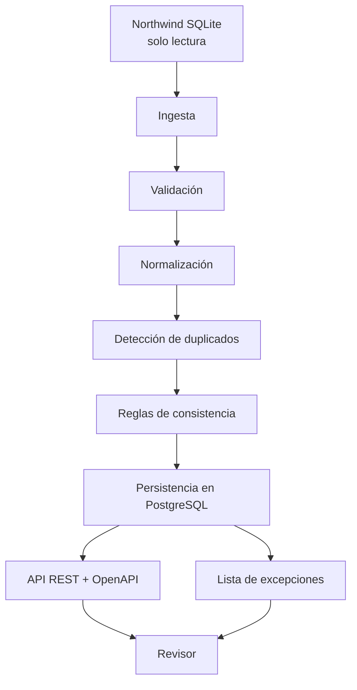

# LedgeProject

LedgeProject es un servicio pequeño que toma datos de Northwind, los ordena con un modelo propio y los guarda en PostgreSQL para que luego se puedan consultar desde una API sencilla.

La idea es que cualquier revisor pueda ver qué pasó en cada corrida, revisar errores o rarezas, y volver a lanzar la ingestión sin que se dupliquen las órdenes ya confirmadas.

## Qué hace

El flujo sigue estos pasos:

1. Lee Northwind SQLite.
2. Valida que los datos tengan forma razonable.
3. Los convierte a un modelo canónico de órdenes y líneas.
4. Detecta duplicados y casos raros.
5. Guarda todo en PostgreSQL.
6. Expone una API para consultar resultados, excepciones y corridas.

## Arquitectura



## Fuente Northwind + verificación

Fuente obligatoria:

https://raw.githubusercontent.com/jpwhite3/northwind-SQLite3/4f56e7f5906dfd23b25244c5bfe8fb5da6402efd/dist/northwind.db

El archivo no se usa como base mutable. Al arrancar, el servicio lo copia a `.runtime/northwind.db` y trabaja sobre esa copia.

El archivo incluido en este repo tiene:

- Tamaño: `24,702,976` bytes
- SHA-256: `2F4F5C68DFCD33BA27373EAE48C7A4869800C68095EE0F9F0DA494F83382A877`

Comprobación manual:

```bash
curl -L -o northwind.db https://raw.githubusercontent.com/jpwhite3/northwind-SQLite3/4f56e7f5906dfd23b25244c5bfe8fb5da6402efd/dist/northwind.db
sha256sum northwind.db
```

En PowerShell:

```powershell
Invoke-WebRequest -Uri "https://raw.githubusercontent.com/jpwhite3/northwind-SQLite3/4f56e7f5906dfd23b25244c5bfe8fb5da6402efd/dist/northwind.db" -OutFile northwind.db
Get-FileHash .\northwind.db -Algorithm SHA256
(Get-Item .\northwind.db).Length
```

## Modelo canónico

El servicio no guarda la forma original de Northwind. La traduce a un formato propio más claro para trabajar con órdenes y líneas.

Ejemplo resumido:

```json
{
	"sourceOrderId": 10248,
	"sourceCustomerId": "VINET",
	"customerCompanyName": "Vins et alcools Chevalier",
	"shipCountry": "France",
	"orderedAt": "1996-07-04T10:00:00.000Z",
	"orderedAtEpoch": 836280000,
	"currency": "EUR",
	"fxRateToUsd": 1.08,
	"sourceGrossMinor": 157900,
	"sourceDiscountMinor": 7895,
	"sourceNetMinor": 150005,
	"sourceTaxMinor": 12375,
	"sourceFreightMinor": 3238,
	"sourceTotalMinor": 166618,
	"normalizedGrossMinor": 146204,
	"normalizedDiscountMinor": 7301,
	"normalizedNetMinor": 138894,
	"normalizedTaxMinor": 11458,
	"normalizedFreightMinor": 2998,
	"normalizedTotalMinor": 153350,
	"duplicateKey": "...",
	"fingerprint": "...",
	"lines": [
		{
			"productId": 11,
			"productName": "Queso Cabrales",
			"quantity": 12,
			"discountRate": 0,
			"sourceUnitPriceMinor": 1400,
			"sourceGrossMinor": 16800,
			"sourceDiscountMinor": 0,
			"sourceNetMinor": 16800,
			"sourceTaxMinor": 1386,
			"normalizedUnitPriceMinor": 1296,
			"normalizedGrossMinor": 15556,
			"normalizedDiscountMinor": 0,
			"normalizedNetMinor": 15556,
			"normalizedTaxMinor": 1283,
			"lineFingerprint": "..."
		}
	]
}
```

## Pipeline

El proceso está separado para que sea fácil de seguir y de revisar:

1. `ingest`: lee Northwind y agrupa órdenes con sus líneas.
2. `validate`: comprueba que los datos tengan sentido.
3. `normalize`: convierte a minor units y aplica la lógica de moneda.
4. `dedupe`: detecta replays y duplicados cercanos por ventana temporal + hash.
5. `consistency-checks`: busca diferencias inusuales entre totales, descuentos e impuestos.
6. `persist`: guarda el resultado en PostgreSQL.
7. `serve/query`: expone la información por REST.

## Reglas de negocio

Hay tres reglas importantes ya implementadas:

- `discount_tax_mismatch`: detecta diferencias inusuales entre descuentos e impuestos esperados y reales.
- `duplicate_window_hash`: marca duplicados por ventana de 15 minutos + hash del contenido.
- `multi-currency mock`: convierte importes con una tabla fija de tipos de cambio documentada.

## Quickstart

### Con Docker

Asumiendo .env ya creado

```bash
docker compose up --build
```

La API queda en `http://localhost:3000`.
La documentación OpenAPI queda en `http://localhost:3000/docs`.

Disparar una ingestión:

```bash
curl -X POST http://localhost:3000/ingestions/run \
	-H "x-api-key: change-me"
```

Consultar datos:

```bash
curl http://localhost:3000/orders -H "x-api-key: change-me"
curl http://localhost:3000/exceptions -H "x-api-key: change-me"
curl http://localhost:3000/ingestions/runs -H "x-api-key: change-me"
```

### Sin Docker

```bash
npm install
npm run check
npm test
npm run migrate
npm run dev
```

## Tests

La suite cubre:

- reglas puras de dedupe, moneda y consistencia
- integración ligera del pipeline con PostgreSQL de pruebas
- API protegida con clave y consultas básicas

Ejecutar todo:

```bash
npm test
```

## Decisiones y supuestos

- Elegí PostgreSQL directo con migraciones SQL para que el esquema sea visible y sencillo.
- Se realizó una separación modular a modo de facilitar la ubicación de diferentes funcionalidades
- Los importes se guardan en minor units para evitar problemas de decimales.
- Northwind no trae moneda ni impuestos listos para usar, así que esas partes se modelan con reglas fijas y documentadas.
- La idempotencia se apoya en `source_order_id` para replays exactos y en `duplicateKey` para duplicados lógicos.
- Las órdenes con warnings se guardan; las que son duplicados se registran como excepción y no se duplican.

## Limitaciones

- No hay UI: la forma de revisar el sistema es la API.
- Los tipos de cambio e impuestos son simulados.
- La base Northwind se trata como entrada fija de solo lectura.
- La ingestión completa puede tardar unos segundos y generar bastantes logs.

## Threat model breve

- Acceso: las rutas de datos y reingesta usan `x-api-key`.
- Abuso: sin la clave no se pueden leer datos ni realizar ejecuciones.
- Datos: no se versionan secretos; `.env.example` sólo trae valores de ejemplo.

## Uso de IA

Usé GitHub Copilot para acelerar partes del scaffold, la separación del pipeline y la documentación inicial. Validé a mano el flujo con:

- `npm run check`
- `npm test`

También revisé manualmente la fuente Northwind, el hash esperado y el comportamiento de la reingesta idempotente.